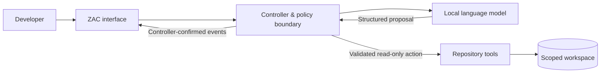

# ZAC — Zomniverse Agent for Code

ZAC is a local-first coding agent focused on **controlled repository investigation**: using language models to help understand software while keeping execution authority, workspace boundaries, and final state under deterministic software control.

> **The model proposes. The controller validates. Only the controller acts.**

This repository is the public technical overview for ZAC. The implementation remains private while the system is under active development.

## Overview

Many coding assistants are optimized primarily for autonomy. ZAC explores a different design question:

**How can an AI coding system remain useful while making authority, permissions, execution, and observed state explicit?**

The current system concentrates on read-only repository analysis. Model output is treated as a proposal rather than an instruction to the operating system. A controller mediates tool use, validates scope, records controller-confirmed activity, and keeps the workspace inside defined boundaries.

## Current scope

| Capability | Current status |
|---|---|
| Repository structure inspection | Available |
| File reading | Available |
| Code and text search | Available |
| Structured, policy-bounded tool use | Available |
| Workspace containment | Available |
| Run cancellation and observable activity | Available |
| Local model inference | Available |
| Automated boundary and regression testing | Available |
| Autonomous file modification | Not exposed |
| Unrestricted shell or process execution | Not exposed |
| Unsupervised Git mutation | Not exposed |
| Arbitrary network access | Not exposed |

The absence of mutation capabilities is intentional at the current stage. Broader authority is treated as a separate security-design problem rather than a default extension of model access.

## Engineering focus

ZAC combines agentic AI work with conventional software control mechanisms.

| Area | Focus |
|---|---|
| **Control plane** | Separating model proposals from executable authority |
| **Security** | Explicit permissions, bounded operations, and workspace containment |
| **Local AI** | Developer-controlled inference for private code workflows |
| **Reliability** | Cancellation, bounded execution, failure handling, and regression testing |
| **Observability** | Controller-confirmed activity rather than model-reported claims |
| **Developer experience** | A practical interface for repository investigation without hiding system state |

## Technical profile

ZAC is primarily developed in **C# / .NET 8** and integrates local language-model inference through an OpenAI-compatible local serving layer. The current interface is browser-based and the canonical development environment is Windows.

The project includes work across:

- agent/controller orchestration;
- asynchronous and cancellable execution;
- structured model/tool interaction;
- filesystem boundary enforcement;
- local LLM integration;
- browser-based developer tooling;
- observability and audit-oriented event flows;
- automated unit, integration, boundary, and adversarial testing.

## Design principles

### Authority is explicit

The language model does not receive direct operating-system authority. It proposes structured actions; deterministic software decides whether those actions are admissible.

### Read-only means read-only

The current tool surface is deliberately constrained to repository investigation. Write, shell, process, Git-mutation, and unrestricted-network capabilities are outside the active model authority.

### Observed state comes from software

The interface distinguishes model narrative from controller-confirmed events. A statement that an action occurred is not treated as proof that the action occurred.

### Local operation matters

Local inference is supported so private repository material can remain inside a developer-controlled environment rather than requiring code to be sent to a hosted model service.

### Capability growth requires review

New authority is not treated as a simple feature toggle. Mutation and broader execution capabilities require separate security design, validation, and review.

## Development status

ZAC is in **active private development**.

The current milestone is centered on making read-only repository investigation dependable: bounded execution, secure workspace access, event correlation, cancellation, local inference, and a usable interface. Work is also continuing on retrieval quality and answer quality during real repository analysis.

The project is not presented as a finished autonomous coding platform. Its purpose at this stage is to build and test a controlled foundation before expanding authority.

## Public repository scope

This repository documents the project at a technical-product level without publishing the private implementation.

It intentionally excludes:

- private source code;
- internal security implementation details;
- operational configuration;
- prompts and schemas;
- private test fixtures;
- deployment-specific material.

That boundary allows the engineering direction, design principles, and project progress to remain visible without turning the public repository into a mirror of the private development codebase.

## Project links

- [CodBio Hub](https://home.codbiohub.com/)
- [Wilder Ruiz on GitHub](https://github.com/wilderruiz)
- [Wilder Ruiz on LinkedIn](https://www.linkedin.com/in/wilder-ruiz/)

---

Copyright © Wilder Ruiz. All rights reserved. Public documentation in this repository does not grant a licence to the private ZAC implementation.
